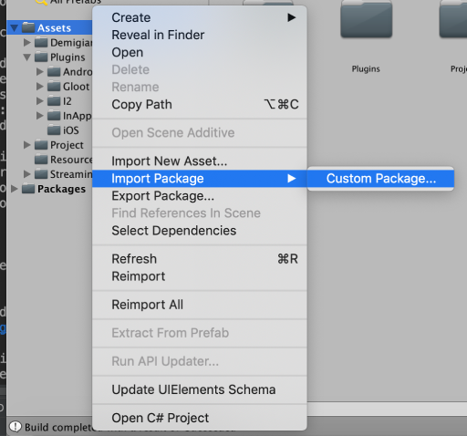
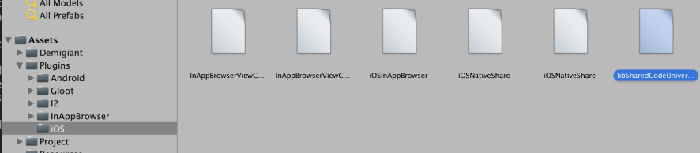
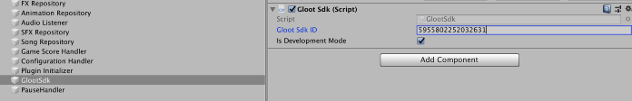

# Unity G-Loot SDK

## Table of Contents

1. [ Prerequisites](#prerequisites)
1. [ Install the gloot-unity-sdk](#installing-the-gloot-unity-sdk-unity-package)
1. [ Setting the SDK up in Unity ](#setting-the-sdk-up-in-unity)
1. [ Using the SDK in Unity ](#using-the-sdk-in-unity)

## Prerequisites

* Currently we only support iOS.
* We only support asynchronous games. If you have a realtime game, we currently can not
report scores in realtime or handle synchronous events. The match needs to use our asynchronous match object
and that match will get users registered to it asynchronously. There is no waiting until a lobby is filled up,
a player plays whenever, and later, when another contender joins the created match object and reports whatever score
that player got at that point in time. Our system will deduce if enough players joined in a given time frame
to end the match end finalize the scores and the stakes.

## Installing the gloot-unity-sdk unity package

In the project explorer, Right click `Assets` and navigate to `Import Package` and then click `Custom Package`
find the `gloot-unity-sdk.unitypackage` and press **Open**



Once done, make sure the following is true:
1. That the `Plugins` folder exists within the `Assets` folder
2. Within the `Plugins` folder, Make sure a folder called `iOS` exists
3. Make sure that the libSharedCodeUniversal.a file exists in the `iOS` folder



## Setting the SDK up in Unity

1. Create an empty GameObject and attach the GlootSdk.cs to it

2. Enter the provided G-Loot SDK ID into the field that now should be shown under the now attached GlootSdk (script)



## Using the SDK in Unity

When the `Gloot Sdk ID` is specified and the glootSdk.cs file has been attached to a GameObject, when that GameObject
awakes, a request will be sent to the G-Loot backend, which makes sure the G-Loot webapp is available and everything is green lit.
This process is asynchronous. To help you wait for the result and as an example make a button available, the following code is used:

```csharp
GlootSdk.Instance.RegisterSdkReadyCallBack(() =>
{
    GameObject readyButton = GameObject.Find("Multiplayer Button");
    Button button = readyButton.GetComponent<Button>();
    button.interactable = true;

});
```
*The same kind of solution could be used to hide a spinner*

#### To show the webapp that is bound to your game and G-Loot id, simply run:
```csharp
GlootSdk.Instance.ShowWebApp()
```
*(the webapp will later handle the navigation back to your game automaticly)*


#### To handle when a match is started from the G-Loot webapp

```csharp
 GlootSdk.Instance.RegisterMatchCallback((Match match) => {
            Debug.Log("Take the user to the actual game");
            this.GoToGameScreen(() =>
            {
                Debug.Log("We are running the game now!");
                this.gameScreenEvents.OnStartSingleplayer(true);
            });
        });
```

The match object contains properties such as seed for the specific match. This must be set in order for the game to be skill based.

The logic for what you want to show when the match is started from the G-Loot webapp, is up to you.
We recommend taking the user directly the actual game.


#### When you want to report a score to the G-Loot backend it is as simple as using this method:
```
GlootSdk.Instance.SendMatchReport(scoreValue = 200, description = "200 points", autoLossReason = "", isFinishedResult = true);
```

> **scoreValue** is just the score as a pure integer.

> **description** is what will later be shown in the webapp, so it is good to think about whether you want to include the scoreValue here or not

> **autoLossReason** is something that can be used to mark a match report with anomalous behvaiour, such as cheating.

> **isFinishedResult** is used to mark the match report as final, and that the score no longer can be updated

#### In order to let the G-Loot backend know that a user has gotten an achievement the following method can be used:
```csharp
GlootSdk.Instance.SendAchievement(string id);
```
The specific achievment ID is created by G-Loot, and if you want to add achievements to your game, please contact us and we will help you out.

#### Trackable Events

If needed, we offer a way to integrate events that happen in the G-Loot webapp
into your analytics tool of choice. 

The following code allows you to
map the events into your internal analytics process:

```csharp
GlootSdk.Instance.RegisterTrackableEventsCallback((eventId, eventPayload) =>
{
    Debug.Log("eventId:" + eventId + " Payload Category:" + eventPayload.category + " Payload Name:"+eventPayload.name + " Payload action:"+ eventPayload.action + " Payload Value: "+eventPayload.value );
});
```

Take a look at our web-event-tracking-readme.md to see which tracking events are being sent out:
[G-Loot Webapp Tracking Events](web-event-tracking-readme.md)

